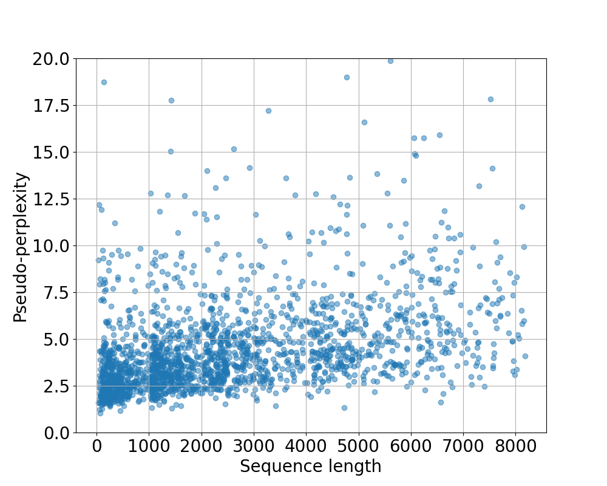
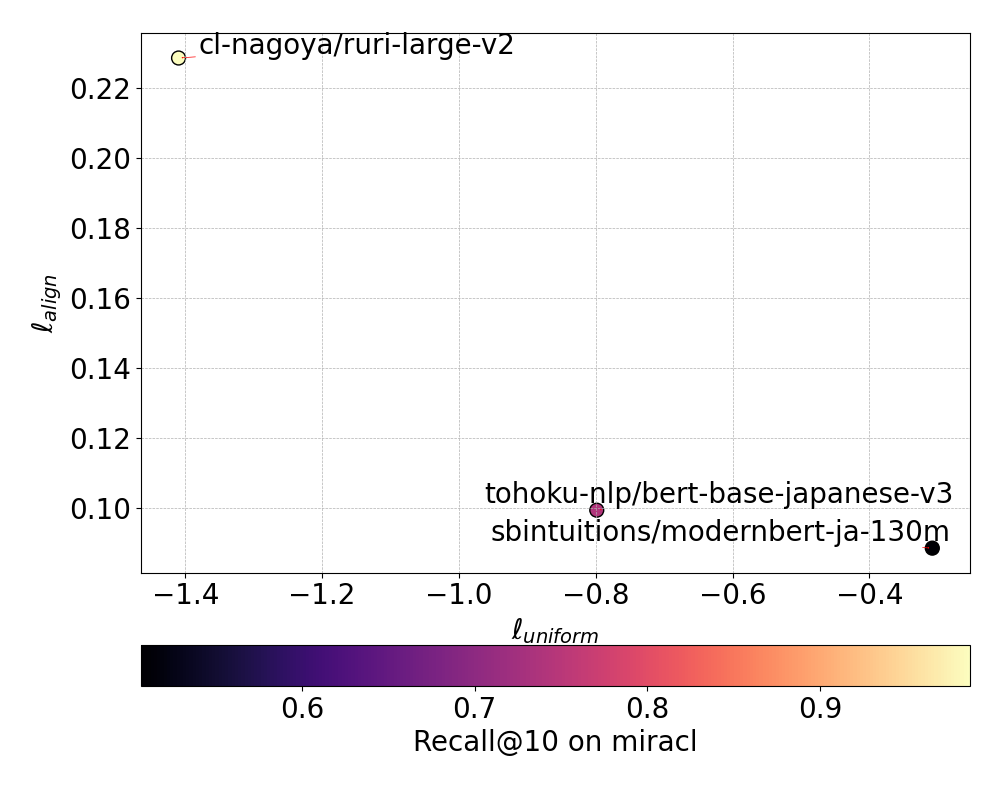
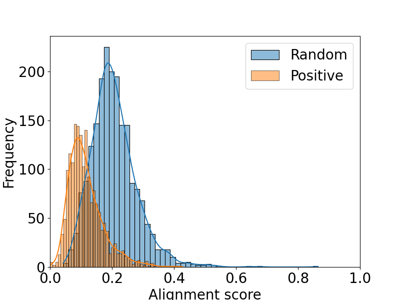

# llm-jp-modernbert
This repository contains train and evaluation code for [llm-jp-modernbert-base](https://huggingface.co/llm-jp/llm-jp-modernbert-base).

Technical report is here: [lm-jp-modernbert: A ModernBERT Model Trained on a Large-Scale Japanese Corpus with Long Context Length]().

This repository provides the training and evaluation code for llm-jp-modernbert-base.
The technical report is available here: [lm-jp-modernbert: A ModernBERT Model Trained on a Large-Scale Japanese Corpus with Long Context Length].

## Installation

```bash
$ uv sync
```

## Train


### Prepare Tokenizer

We use [llm-jp-tokenizer v3.0b2](https://github.com/llm-jp/llm-jp-tokenizer) as the tokenizer for the model.

The original [llm-jp-tokenizer v3.0b2](https://github.com/llm-jp/llm-jp-tokenizer) is designed for decoder-only models. It adds a beginning-of-sequence (BOS) token \<s\> before each input:

```python
>>> from transformers import AutoTokenizer
>>> tokenizer = AutoTokenizer.from_pretrained("llm-jp/llm-jp-3-1.8b")
>>> print([tokenizer.decode(token) for token in tokenizer("foo", return_tensors="pt")["inpu
t_ids"][0]])
['<s>', 'foo']
>>> print([tokenizer.decode(token) for token in tokenizer("foo", "bar", return_tensors="pt"
)["input_ids"][0]])
['<s>', 'foo', '<s>', 'bar']
```

For encoder-based models like BERT, proper use of special tokens ([CLS], [SEP]) is required. To adapt the tokenizer for such use cases, run:

```bash
$ python src/train/prepare_tokenizer.py
```
This modifies the tokenizer to output BERT-compatible tokens:

```python
tokenizer("こんにちは")
# {'input_ids': [5, 39801, 6], 'attention_mask': [1, 1, 1]}
tokenizer.decode([5, 39801, 6])
# <CLS|LLM-jp> こんにちは <SEP|LLM-jp>
```


### Prepare ModernBERT

To set up a modernbert-base model with the modified tokenizer, run:
```bash
python src/train/prepare_modernbert.py
```

### Pre-train

To train the model, run the following command (This script uses Japanese subset of the Wikipedia):
```bash
$ bash script/train.sh
```

To handle datasets that don't fit in memory, this implementation uses IterableDataset.
It is adapted from the official Hugging Face script:
https://github.com/huggingface/transformers/blob/main/examples/pytorch/language-modeling/run_mlm_no_trainer.py

Unlike the original, which does not support checkpoint resumption when using IterableDataset, this code supports resuming from checkpoints even when using IterableDataset.

#### Use Custom Dataset

Prepare your dataset by placing JSON files containing only a "text" field into separate train and test directories, as shown below:

Example JSON file:
```json
{"text": "foo"}
{"text": "bar"}
```

In this example, we use a subset of the Japanese Wikipedia dataset.
```bash
$ python src/train/prepare_dataset.py
```

This will create a directory structure like this:
```bash
$ tree dataset
dataset/
└── wiki_ja_nano
    ├── test
    │   └── 00000.json
    └── train
        └── 00000.json
```

You can download a large-scale Japanese corpus from [llm-jp-corpus-v3](https://gitlab.llm-jp.nii.ac.jp/datasets/llm-jp-corpus-v3).

When using a large, non-shuffled dataset, it's recommended to keep each JSON file small.
This is because IterableDataset performs approximate shuffling: it first shuffles the list of shards (files), then sequentially loads them into a buffer and shuffles only within that buffer.
If individual files are too large, the shuffling becomes less effective due to limited mixing across files.
For more detailes, refer to the [Hugging Face documentation](https://huggingface.co/docs/datasets/v3.5.0/en/package_reference/main_classes#datasets.IterableDataset.shuffle).

## Evaluation
Let's evaluate BERT models from various perspectives!


### Evaluate on JGLUE

To evaluate the performance of models on the JGLUE benchmark, run the following command:
```bash
$ python src/eval/run_glue_no_trainer.py \
                --model_name_or_path llm-jp/llm-jp-modernbert-base \
                --task_name JSTS \
                --max_length 512 \
                --per_device_train_batch_size 32 \
                --learning_rate 2e-5 \
                --num_train_epochs 3 \
                --output_dir results
```

Make leaderboard
```bash
$ python src/eval/make_leaderboard.py
```
| Model                         | JSTS | JNLI | JCoLA | Avg(JGLUE) |
| ----------------------------- | ---- | ---- | ----- | ---------- |
| llm-jp/llm-jp-modernbert-base | 91.8 | 91.3 | 84.4  | 89.2       |


### Zero-shot Sentence Retrieval Task using miracl dataset

To evaluate the retrieval performance of models on the miracl dataset, run the following command:
```bash
$ python src/eval/zeroshot_retrieval.py --model llm-jp/llm-jp-modernbert-base
Model: llm-jp/llm-jp-modernbert-base
Recall@10: 0.574
MRR@10: 0.389
```


### Pseudo-Perplexity

To conduct the pseudo-perplexity evaluation (refer to the paper [NeoBERT](https://arxiv.org/abs/2502.19587)), run the following command:
```bash
$ python src/eval/pseudo_perplexity.py --model llm-jp/llm-jp-modernbert-base --num_examples 2000
```

You can decrease the number of examples to speed up the evaluation.

### Alignment & Uniformity

To conduct the alignment and uniformity evaluation (refer to the paper [SimCSE](https://arxiv.org/abs/2104.08821)), run the following command:
```bash
$ python src/eval/alignment_and_uniformity.py
```


Also, you can visualize the sentence similarity distribution by running the following command:
```
$ python src/eval/sim_distribution.py --model llm-jp/llm-jp-modernbert-base
```


### Fill Mask Task

To compare the performance of BERT models on the fill-mask task, run the following command:
```bash
$ python src/eval/fill_mask_test.py --text "今日のご飯は{mask_str}である。"
Question: 今日のご飯は{mask_str}である。
cl-tohoku/bert-base-japanese-v3: こう, sbintuitions/modernbert-ja-130m: カレーライス, llm-jp/llm-jp-modernbert-base: 納豆,
```

## Citation

```bibtex
TODO:
```

## References

- [ModernBERT](https://arxiv.org/abs/2412.13663)
- [run_mlm_no_trainer.py, HuggingFace transformers](https://github.com/huggingface/transformers/blob/main/examples/pytorch/language-modeling/run_mlm_no_trainer.py)
- [llm-jp-tokenizer](https://github.com/llm-jp/llm-jp-tokenizer)
- [llm-jp-corpus-v3](https://gitlab.llm-jp.nii.ac.jp/datasets/llm-jp-corpus-v3)
- [run_glue_no_trainer.py, HuggingFace transformers](https://github.com/huggingface/transformers/blob/main/examples/pytorch/text-classification/run_glue_no_trainer.py)
- [JGLUE](https://github.com/yahoojapan/JGLUE)
- [SimCSE](https://arxiv.org/abs/2104.08821)
- [NeoBERT](https://arxiv.org/abs/2502.19587)


